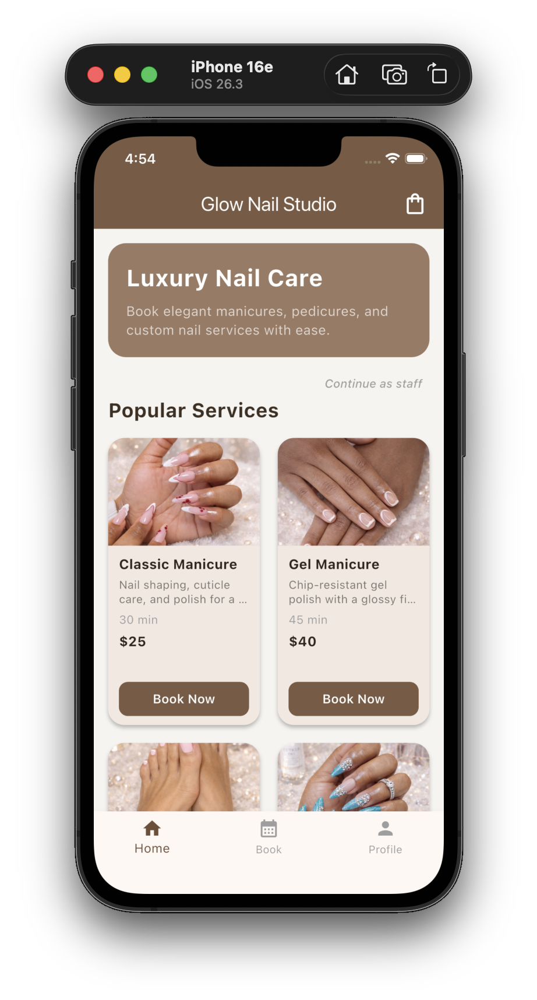
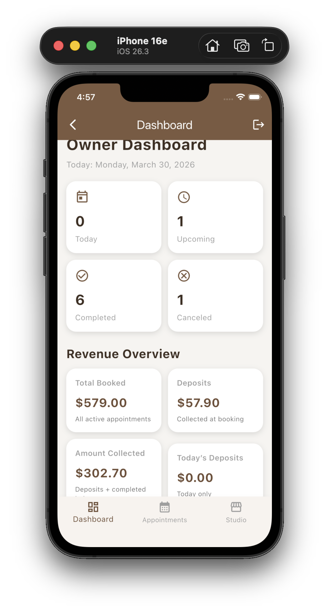
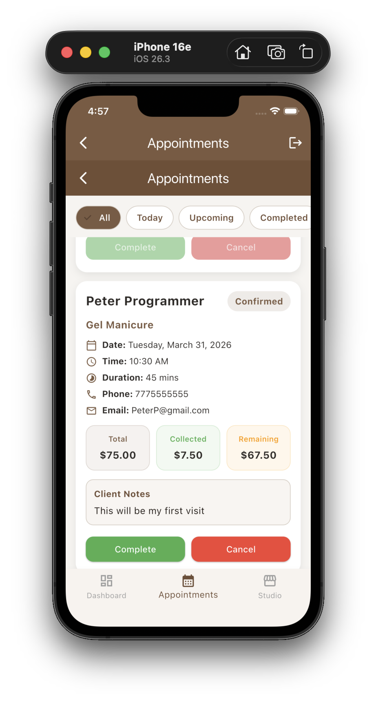
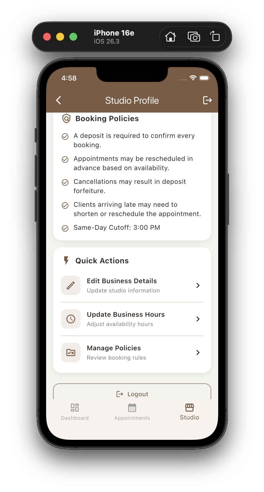
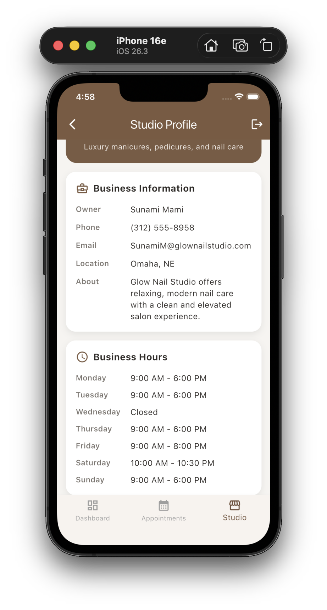
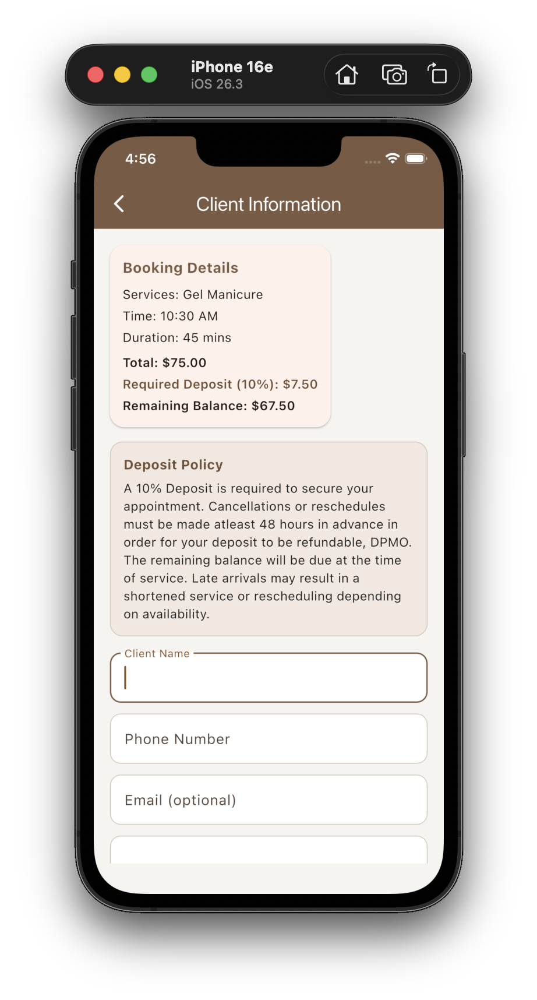

# Glow Nail Studio App 💅

A modern Flutter-based mobile booking app designed for nail technicians and beauty businesses.

This app allows customers to easily browse services, book appointments, and manage their bookings, while giving business owners a clean dashboard to track appointments and earnings.

---

## ✨ Features

- Browse nail services with detailed descriptions
- Add multiple services to cart
- Confirm bookings with deposit tracking
- View upcoming and past appointments
- Cancel bookings with confirmation
- Owner dashboard with appointment management
- Amount collected tracking system
- Clean, modern UI/UX design

---

## 🛠 Tech Stack

- Flutter (Dart)
- Material UI
- Local state management

## Screenshots

### Home Page

### Owner Dashboard

### Owner Appointments

### Quick Actions

### Studio Profile

### Client Information

## Future Improvements
- Payment integration
- Multi-business support
- User authentication
